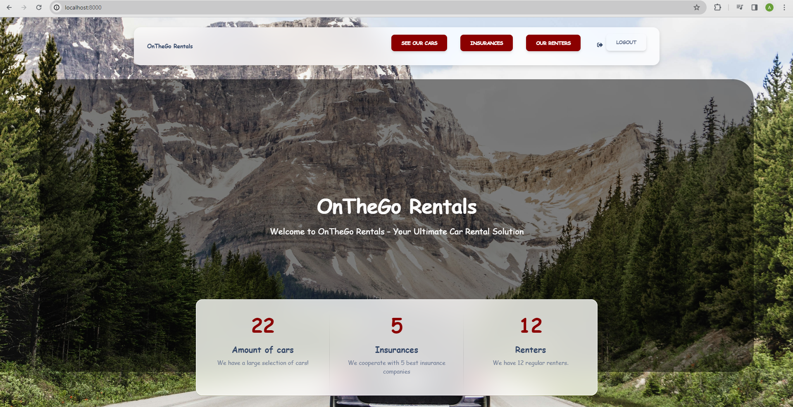

# Rental service OnTheGo
> Project "OnTheGo Rentals" is a car rental service that provides convenient solutions for people who are on the move.

## Check it out!
[Check "OnTheGo Rentals" project at Render](https://car-rental-service-onthego-rentals.onrender.com)

*If you want to deploy this project on render.com, you need to specify the following environmental variables:

* DATABASE_URL
* DJANGO_DEBUG
* DJANGO_SECRET_KEY
* PYTHON_VERSION
* WEB_CONCURRENCY


For login use following login and password:

* Login: `admin.user`
* Password: `1qazcde3`

## Technological stack

For this project i used:

>* python 3.11
>* django 5.0.3
>* crispy-bootstrap 2024.2
>* django-crispy-forms 2.1

## Installation instructions

For beginning you have to install Python3+ 

In terminal write down following commands:

```shell
git clone https://github.com/ArturPoltser/py-car-rental-service.git
python -m venv venv
venv\Scripts\activate  #for MacOS/Linux use: source vevn/bin/activate
pip install -r requirements.txt
python manage.py migrate
python manage.py collectstatic
python manage.py runserver
```
Also for testing you can load already prepared data:

```shell
python manage.py loaddata car_rental_service_db_data.json
```
## DataBase Structure:


## Project Home Page:

